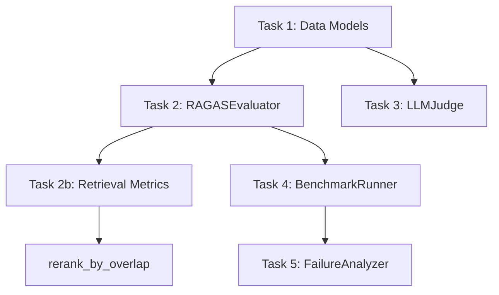

# Phương Pháp Tối Ưu — AI Evaluation & Benchmarking Pipeline (Day 14)

## Phân Tích Hiện Trạng

- **39/39 tests FAILED** — tất cả đều do `NotImplementedError` hoặc `TypeError` (dataclass chưa có fields)
- Test suite import từ `solution/solution.py` (ưu tiên) → nếu không có thì dùng `template.py`
- Cần tạo `solution/solution.py` để tests chạy đúng mà không sửa `template.py` gốc

## Chiến Lược Tối Ưu: 3 Pha Tuần Tự

> [!IMPORTANT]
> **Nguyên tắc chính**: Code trước → Chạy test → Dùng output thực để điền exercises/reflection.
> Điều này đảm bảo dữ liệu trong báo cáo **nhất quán với code thực tế**, không phải số bịa.

---

## Pha 1: Implement `solution/solution.py` (Mục tiêu: 39/39 tests PASS)

### Thứ tự implement tối ưu (theo dependency)



### Task 1 — Data Models (nền tảng, phải làm trước)

**`QAPair`** — Tests gọi cả positional args lẫn keyword args:
```python
@dataclass
class QAPair:
    question: str
    expected_answer: str
    context: str = ""
    metadata: dict = field(default_factory=dict)
    retrieved_contexts: list = field(default_factory=list)
```

> [!WARNING]
> Test `TestEvalResultOverallScore._make_result` gọi `QAPair("q", "expected", None, {})` — truyền `context=None`. Code phải chấp nhận `None` mà không crash.

**`EvalResult`** — Phải đặt fields có default SAU fields không default:
```python
@dataclass
class EvalResult:
    qa_pair: QAPair
    actual_answer: str
    faithfulness: float
    relevance: float
    completeness: float
    passed: bool
    failure_type: str | None = None
    context_precision: float | None = None
    context_recall: float | None = None

    def overall_score(self) -> float:
        return (self.faithfulness + self.relevance + self.completeness) / 3.0
```

---

### Task 2 — RAGASEvaluator (answer-side)

3 hàm dùng cùng pattern word-overlap — tạo helper nội bộ để DRY:

```python
def _overlap_score(numerator_text, denominator_text) -> float:
    """Generic: |tokens(num) ∩ tokens(den)| / |tokens(den)|"""
    den_tokens = _tokenize(denominator_text)
    if not den_tokens:
        return 1.0
    num_tokens = _tokenize(numerator_text)
    overlap = len(num_tokens & den_tokens)
    return min(max(overlap / len(den_tokens), 0.0), 1.0)
```

| Method | numerator | denominator | Edge case |
|--------|-----------|-------------|-----------|
| `evaluate_faithfulness(answer, context)` | context | answer | answer empty → 1.0 |
| `evaluate_relevance(answer, question)` | answer | question | question empty → 1.0 |
| `evaluate_completeness(answer, expected)` | answer | expected | expected empty → 1.0 |

> [!TIP]
> **Lưu ý công thức faithfulness**: mẫu số là `|answer_tokens|`, tử số là `|answer ∩ context|`. Tức là numerator_text = answer nhưng denominator_text cũng = answer, intersection với context. Cần cẩn thận: `|answer ∩ context| / |answer|`.

**`run_full_eval`** — Kết hợp 3 metrics + failure classification:
- `passed = faith >= 0.5 and rel >= 0.5 and comp >= 0.5`
- failure_type: chain `if faith < 0.3 → "hallucination"`, `elif rel < 0.3 → "irrelevant"`, `elif comp < 0.3 → "incomplete"`, `elif not passed → "off_topic"`, `else None`

---

### Task 2b — Retrieval-side Metrics

**`evaluate_context_recall`** — Union coverage:
```
union_tokens = set()
for chunk in contexts:
    union_tokens |= _tokenize(chunk)
recall = |expected_tokens ∩ union_tokens| / |expected_tokens|
```

**`evaluate_context_precision`** — Rank-aware AP@K (thuật toán quan trọng nhất):
```
1. expected_tokens = _tokenize(expected)
2. Với mỗi chunk[k]: relevant[k] = (|chunk_tokens ∩ expected_tokens| / |expected_tokens|) >= threshold
3. total_relevant = sum(relevant)
4. Nếu total_relevant == 0: return 0.0
5. AP = 0; rel_count = 0
   for k in range(len(contexts)):
       if relevant[k]:
           rel_count += 1
           precision_at_k = rel_count / (k + 1)
           AP += precision_at_k
6. return AP / total_relevant
```

**`rerank_by_overlap`** — Đơn giản nhất, hint đã cho sẵn:
```python
return sorted(contexts, key=lambda c: len(_tokenize(c) & _tokenize(query)), reverse=True)
```

---

### Task 3 — LLMJudge

**`__init__`**: Lưu `self.judge_llm_fn = judge_llm_fn`

**`score_response`**:
1. Build prompt chứa question, answer, rubric
2. Gọi `self.judge_llm_fn(prompt)` → lấy raw response
3. Cố parse JSON (`json.loads`), map scores sang `float`
4. Nếu parse fail → default `{criterion: 0.5 for criterion in rubric}`

> [!IMPORTANT]
> Mock test trả về `'{"accuracy": 0.8, "clarity": 0.7}'` — test chỉ kiểm tra key `"scores"` và `"reasoning"` tồn tại, không kiểm tra giá trị cụ thể. Nhưng parse đúng JSON sẽ cho kết quả tốt hơn.

**`detect_bias`**:
- Thu thập tất cả scores từ batch → tính avg
- `leniency_bias = avg > 0.8`
- `severity_bias = avg < 0.3`
- `positional_bias`: kiểm tra xem score giảm dần theo index → nếu batch có >= 2 items và score[0] > score[-1] thì `True` (đơn giản hóa theo spec "first response consistently scores higher")

---

### Task 4 — BenchmarkRunner

**`run`**: Loop qa_pairs → call `agent_fn(pair.question)` → call `evaluator.run_full_eval(answer, pair.question, pair.context, pair.expected_answer)`

**`generate_report`**: Tính average bằng `sum(r.X for r in results) / len(results)`, đếm failure_types bằng Counter-like dict

**`run_regression`**: 
- Tính avg cho 3 metrics ở cả new và baseline
- `regressions = [name for name in metrics if baseline_avg - new_avg > 0.05]`
- `passed = len(regressions) == 0`

**`identify_failures`**: `[r for r in results if r.faithfulness < threshold or r.relevance < threshold or r.completeness < threshold]`

---

### Task 5 — FailureAnalyzer

**`categorize_failures`**: Counter trên `f.failure_type`

**`find_root_cause`**: So sánh 3 scores, tìm min:
- Nếu min là faithfulness → "Context is missing or irrelevant — improve retrieval"
- Nếu min là relevance → "Answer does not address the question — improve prompt clarity"
- Nếu min là completeness → "Answer is missing key information — increase context window or improve generation"
- Nếu bằng nhau → "Multiple issues detected — review full pipeline"

**`generate_improvement_suggestions`**: Categorize trước, rồi tạo suggestion dựa trên loại lỗi. Luôn trả về ≥ 3 items.

**`generate_improvement_log`**: Build Markdown table string, mỗi failure 1 row, Status = "Open".

---

## Pha 2: Hoàn thành `exercises.md`

### Workflow:
1. **Part 1** (Warm-up): Điền bảng RAGAS thresholds, bias experiment design, CI/CD thresholds — lấy từ lý thuyết trong README
2. **Part 3.1** (Golden Dataset): Tạo 20 QA pairs cho domain AI/RAG — stratified 5E+7M+5H+3A
3. **Part 3.2** (Benchmark Run): Chạy `BenchmarkRunner` trên 20 pairs → ghi kết quả thực
4. **Part 3.3** (Rubric Design): Thiết kế rubric 5 mức cho domain AI
5. **Part 3.5** (Reranking): Chạy `evaluate_context_precision` trên R01-R05 trước/sau rerank → ghi delta

> [!TIP]
> **Phương pháp tối ưu**: Viết 1 script scratch chạy tất cả benchmark + reranking experiments cùng lúc, output kết quả ra console → copy paste vào exercises.md. Tránh chạy tay từng lệnh.

---

## Pha 3: Hoàn thành `reflection.md`

### Workflow:
1. Paste benchmark summary từ Pha 2
2. Chọn 3 failures có `overall_score` thấp nhất → phân tích 5 Whys
3. Gọi `find_root_cause()` cho mỗi failure → so sánh với phân tích manual
4. Gọi `generate_improvement_log()` → paste output
5. Gọi `generate_improvement_suggestions()` → paste 3 suggestions
6. Mô tả CI/CD integration strategy

---

## Verification Plan

### Automated Tests
```bash
pytest tests/ -v
```
Mục tiêu: **39/39 PASSED**

### Manual Verification
```bash
python solution/solution.py
```
Kiểm tra output benchmark report, failure categories, và improvement log chạy đúng.

### Script thực nghiệm cho exercises
Viết `scratch/run_experiments.py` để:
- Chạy benchmark trên 20 QA pairs
- Đo context recall/precision trước và sau rerank cho R01-R05
- Output tất cả kết quả formatted sẵn để copy vào exercises.md

---

## Thang Điểm & Ưu Tiên

| Tiêu chí | Điểm | Độ ưu tiên |
|----------|-------|------------|
| Tất cả pytest pass | **50** | 🔴 Cao nhất |
| Golden dataset 20 QA stratified | **15** | 🟡 Cao |
| LLM-as-Judge rubric design | **10** | 🟡 Cao |
| Failure analysis (5 Whys) + improvement log | **15** | 🟡 Cao |
| Code quality, type hints, regression strategy | **10** | 🟢 Trung bình |

> [!IMPORTANT]
> **50% điểm nằm ở pytest pass** → Pha 1 (code) là quan trọng nhất và phải hoàn thành đầu tiên.
